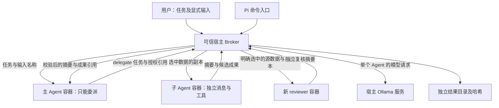

# 从头设计：为什么选择 Capsule + Broker + Artifact

1.1.0 补充：入口采用 CLI / MCP / Pi 薄适配层，共用 `api.run_request`。外部聊天 Agent 不是内部主 Agent；真正主 Agent 始终由独立核心创建。详见 [入口设计](ENTRYPOINTS.md)。

## 1. 先解释题目

已知题目：“打包一个主 Agent 和子 Agent 完全隔离的插件”。没有老师对隔离层级、Pi 版本和评分标准的进一步定义。因此把共同要求保留：主 Agent 只委派，子 Agent 独立执行，各自上下文/提示词/工具分离，可安装、可复现。不能为追求不同而放弃这些题目要求。

本项目选择的问题是：隔离不能意味着完全没有通信，否则无法协作；需要明确哪些信息可跨越边界，以及谁执行这个规则。

## 2. 三份同学作业的对照

对照依据是本项目目录中的本地源码，以及本项目另一个任务“解读 pi-agent-orchestrator 作业”。没有使用同学的测试结果作为本项目的证据。

| 作业 | 现有重点 | 本项目避免重复的主线 |
|---|---|---|
| Juleeeke / pi-agent-orchestrator | 新 Pi RPC 进程、任务契约、只读 Scout、上下文污染对照实验 | 不以“再启动一个 RPC 子进程”或费用对比作为创新点 |
| NEAL-BUAA / pi-isolated-agents | 复用 pi-open-agents，角色提示词、独立技能及权限配置 | 不包装相同角色配置，不依赖 pi-open-agents |
| Wuuukoyi / pi-subagent-orchestrator | 主代理只委派，多角色，并行和链式执行 | 不以并行数量和 Scout/Planner/Worker/Reviewer 链条作为特色 |
| 本项目 pi-capsule-agents | 主子容器隔离、宿主推理代理、无挂载数据副本、显式授权和成果交付 | 用可执行的边界和交付流程回答“隔离之后怎样合作” |

三份项目都有明确可借鉴的思想。这里只主张实现路线及重点不同，不主张全世界首次提出此架构，也不保证任何两份多 Agent 程序没有共同代码模式。主/子、任务、结果这些结构是题目本身所必需的。

参考项目：
- https://github.com/Juleeeke/pi-agent-orchestrator
- https://github.com/NEAL-BUAA/pi-isolated-agents
- https://github.com/Wuuukoyi/pi-subagent-orchestrator

## 3. 比较候选形式

| 形式 | 优点 | 代价 | 选择 |
|---|---|---|---|
| 角色配置包 | 最容易安装解释 | 和第二份重合，强边界依赖底层 | 不选 |
| 纯进程编排器 | 跨平台、较轻 | 与第一/三份接近，同用户仍可读宿主 | 仅作开发测试后端 |
| 每个 Agent 容器内直接访问模型 | 文件/进程隔离明确 | 必须开放网络并把凭据放入容器 | 不选 |
| 无网络容器 + 宿主推理 Broker | Agent 无凭据、无宿主目录，通道明确 | 需要 Docker，多一层通信 | 选择 |
| MicroVM/独立机器 | 内核边界更强 | 教学部署与跨平台演示成本高 | 后续可替换运行后端 |

这不是所有场景下的绝对最优。它在“与已有作业区别、隔离解释力度、代码可读性、可演示性”之间较均衡。若老师仅要求 Pi 原生上下文隔离，容器部分属于额外深化。

## 4. 架构与信任边界

可信：用户、宿主 Broker 源码、Docker、镜像、模型服务。受限制：模型产生的动作、文件内容、候选成果。Pi 宿主对话不在主 Agent 容器中，入口不会向内部转发这段历史。

同一宿主模型服务处理不同 Agent 的独立请求，模型计算服务没有物理隔离。聊天上下文由各自请求的 messages 决定，代码不拼接其他 Agent 历史。模型服务内部缓存/日志属于服务可信边界，不声称不可观察。

## 5. 信息流比“新进程”更重要

1. 用户用 `--input report.txt=真实路径` 授权文本。Broker 读一次并保存内存快照。
2. main 只知道 `report.txt` 这个名称，不获得正文或真实路径。
3. main 委派时显式列出 `inputs`。Broker 拒绝未知引用、重复引用、名称冲突和超额大小。
4. 子 Agent 得到独立 JSON 包，仅含角色、任务、指定输入副本。
5. 子 Agent 的 list/read 只访问该包内的映射，不访问工作区。
6. 子 Agent 可生成候选文本成果。Broker 检查名称、角色、大小和数量，再生成服务端 SHA-256。
7. main 得到摘要与成果引用，不得到子 Agent 全部工具轨迹。
8. main 可显式授权新的 reviewer 读取源数据及成果副本；reviewer 从零开始，不继承作者过程。

这里的“能力授权”是 Broker 的内存目录及每次调用的白名单，不是密码学令牌。引用无法通过猜名字访问其他 run 的产物，因为每个 run 有全新的 catalog，且宿主没有开放任意读取接口。

## 6. 隔离验收矩阵

| 边界 | 执行机制 | 如何验证 |
|---|---|---|
| 父历史 | 子输入无 history 字段，新 messages 列表 | 在主任务放 canary，检查子模型请求 |
| 提示词/技能 | 固定角色函数，不发现外部资源 | 镜像只包含 worker.py |
| 工具权限 | role + action 分支拒绝 | reviewer write、子 delegate 测试 |
| 原始文件 | 不挂载宿主，只传文本副本 | 检查 Docker 参数和未授权读取拒绝 |
| 凭据/环境 | 容器不传 env、无认证文件 | Docker canary 检查 |
| 网络 | `--network=none` | Docker socket connect 失败 |
| 主子进程/临时数据 | 每次 docker run，独立 tmpfs | 新容器不看到上一个临时标记 |
| 成果 | 白名单类型、平面名称、哈希与独立目录 | 路径穿越拒绝，实际文件哈希核对 |
| 故障 | 有限步骤、请求、委派、截止时间及清理 | 无效 JSON 耗尽预算、推理失败测试 |

## 7. 工具与协议

Worker→Broker JSONL 消息：`model` 请求推理、`delegate` 请求委派（仅 main）、`result` 正常交付、`error` 失败。不是开放的 RPC 方法表，不支持任意执行命令。

模型动作：main 只有 delegate/final；analyst/author 有 list/read/calculate/csv_stats/write/final；reviewer 无 write。`calculate` 使用 AST 白名单，仅数字和四则运算，不执行 Python 源代码。

`write` 在内存里形成候选文本，不赋予真实目录权限。作者仍可写错误内容；数据正确性需要检测/复核，不由权限机制保证。

固定边界：每个 Agent 最多 18 个模型动作，整次任务最多 64 次推理、6 次委派；输入最多 8 份、单份 32KiB、合计 64KiB；每 Agent 最多 4 个 32KiB 成果；协议单帧 256KiB；默认总时间 300 秒。超过限制失败或向 main 返回拒绝，不静默截断有效成果。

## 8. 有意保留的限制

- 当前按顺序执行子任务，没有 DAG/并发/持久化恢复，避免与同学主要卖点重叠和扩大作业范围。
- 真实模型必须能输出约定 JSON；格式重试消耗步骤预算，任务可能失败。
- 不支持任意 shell、安装依赖或执行生成代码。适合文本分析、简单 CSV 分析、起草与复核，不是完整编程代理。
- 只有 UTF-8 文本成果；不直接应用补丁或修改用户项目。
- 不做内容敏感性自动分类：用户显式授权的内容会进入模型请求。若 main 将自身信息主动写进任务，无法靠进程隔离阻止。
- 容器不抵御内核逃逸、宿主管理员、恶意 Docker daemon；更强边界可用 microVM 替换。
- SHA-256 是完整性校验，不是签名；audit 不是不可篡改账本。
- 真实模型 reviewer 不构成正确性证明；实验数据和真实材料性能结论不可混同。
- 进程测试验证协议；只有运行可选 Docker 测试才能验证本机上的容器边界。

## 9. 可用作报告摘要

本项目实现了一种以显式数据授权和成果交付为核心的隔离式主子 Agent 插件。主 Agent 仅负责委派，子 Agent 在独立、无网络且无宿主目录挂载的容器中完成受限工具操作。模型调用由可信宿主代理完成，避免将模型凭据下放到执行环境。通过输入副本、结果校验、内容哈希和全新上下文的独立复核，系统将跨 Agent 协作限制在可检查的信息通道内。项目提供进程级自动测试及可选容器集成测试，并明确区分流程完成、隔离边界和模型答案正确性。
